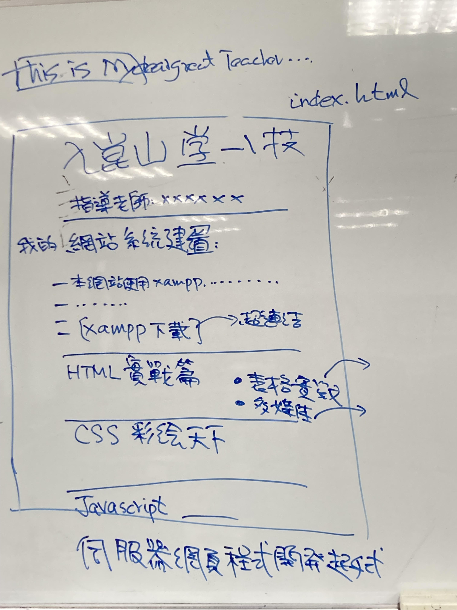

## 


```html
<html>
  
<head>
  <title>This is Mydeargreatteacher speaking</title>
  <meta charset="UTF-8">
<style>

.center{
  text-align: center;
}
</style>
</head>  
  
<body>

<h1 class="center">Learning web programing </h1>

<h2 class="center">Power of html</h2>
  
<h2 class="center">CSS</h2>
  
<h2 class="center">Javascript</h2>

<h2 class="center">Server-side programming with PHP</h2>

</body>
</html>

```
