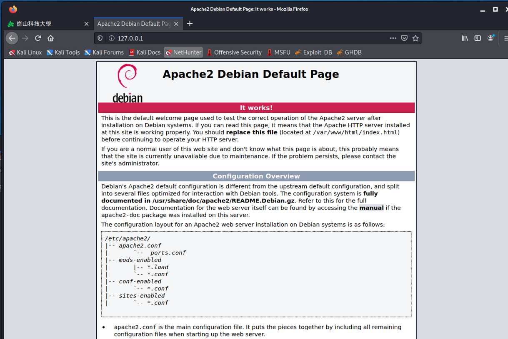
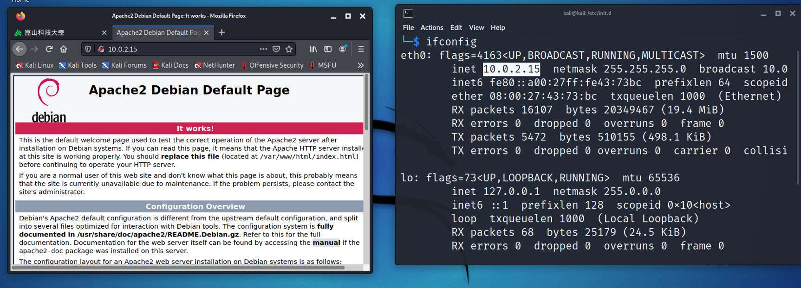
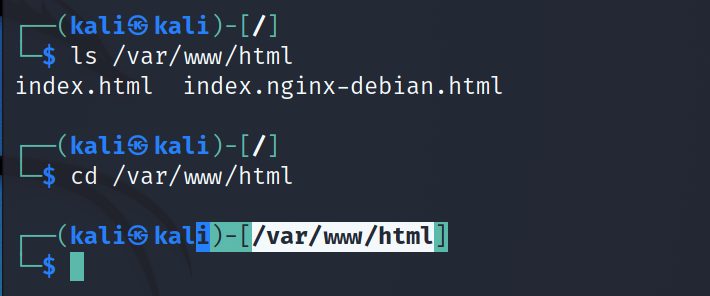
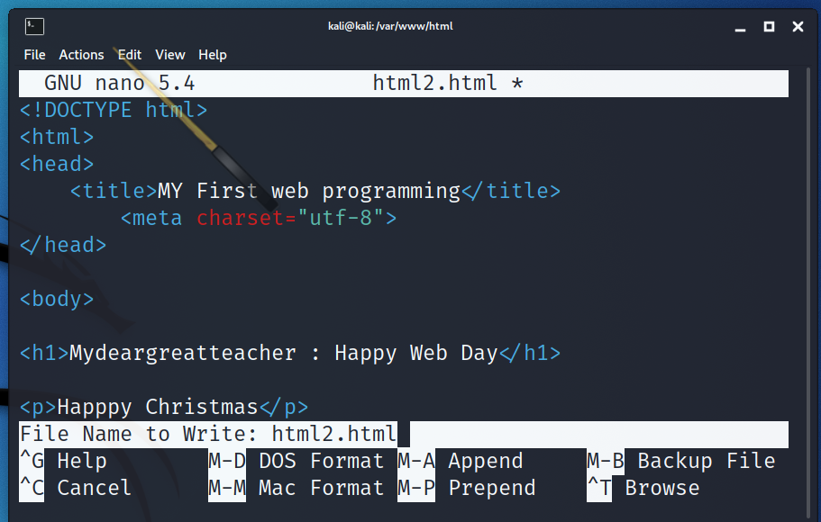
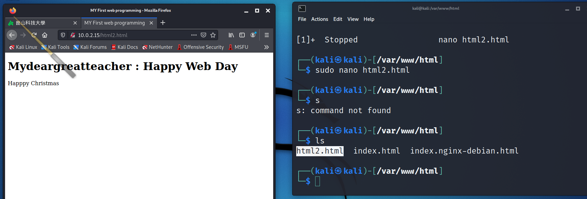
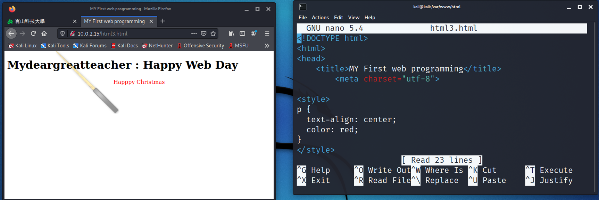

# Linux 伺服器建置報告

 - apache 網站伺服器建置
 - Mysql 資料庫伺服器建置
 - PHP
 - 網站程式開發

# 1_apache 網站伺服器建置: 以Kali linux 2021.3版為基礎

### service apache2 status
```
apache2.service - The Apache HTTP Server
     Loaded: loaded (/lib/systemd/system/apache2.service; disabled; vendor preset: disabled)
     Active: inactive (dead)
       Docs: https://httpd.apache.org/docs/2.4/
```
### cd /etc/init.d

### ls
```
apache2              hwclock.sh         openvpn                      screen-cleanup
apache-htcacheclean  inetsim            plymouth                     smartmontools
apparmor             iodined            plymouth-log                 smbd
atftpd               ipsec              postgresql                   snmpd
avahi-daemon         keyboard-setup.sh  procps                       speech-dispatcher
binfmt-support       kmod               ptunnel                      ssh
bluetooth            lightdm            pulseaudio-enable-autospawn  sslh
console-setup.sh     mariadb            redsocks                     stunnel4
cron                 miredo             rpcbind                      sudo
cryptdisks           networking         rsync                        sysstat
cryptdisks-early     nfs-common         rsyslog                      udev
dbus                 nginx              rwhod                        virtualbox-guest-utils
dns2tcp              nmbd               samba-ad-dc                  x11-common
haveged              ntp                saned                        xl2tpd
```


```
#/etc/init.d/apache2 start
#/etc/init.d/apache2 stop
#/etc/init.d/apache2 restart
```
## ./apache2 -h 
```
Usage: apache2 {start|stop|graceful-stop|restart|reload|force-reload}
```
### ./apache2 start
```
Starting apache2 (via systemctl): apache2.service.
```
### 打開瀏覽器 ==> 輸入網址 127.0.0.1 ==>  就  成功



### 檢視你電腦的IP==> 輸入網址==>  也  成功



# 網站開發
- 網站根目錄 ==>/var/www/html



## 在網站根目錄/var/www/html底下開始開發程式 ==> 使用nano html2.html
```
<!DOCTYPE html>
<html>
<head>
    <title>MY First web programming</title>
	<meta charset="utf-8">
</head>

<body>

<h1>Mydeargreatteacher : Happy Web Day</h1>

<p>Happpy Christmas</p>

</body>
</html>
```





## 加入ＣＳＳ ==> html3.html
```html
<!DOCTYPE html>
<html>
<head>
    <title>MY First web programming</title>
	<meta charset="utf-8">
   <style>
p {
  text-align: center;
  color: red;
} 
</style>
</head>

<body>

<h1>Mydeargreatteacher : Happy Web Day</h1>

<p>Happpy Christmas</p>

</body>
</html>

```


