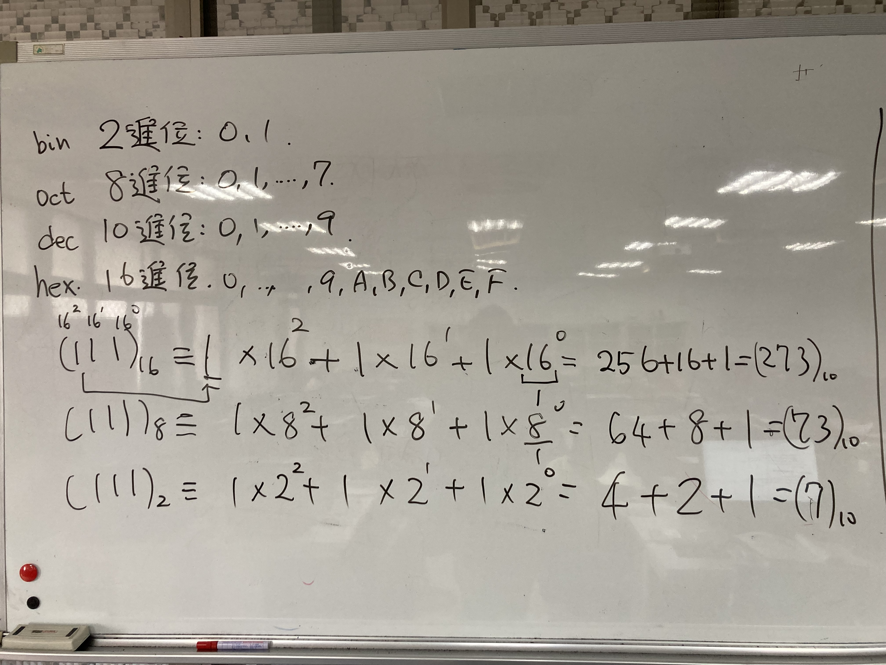
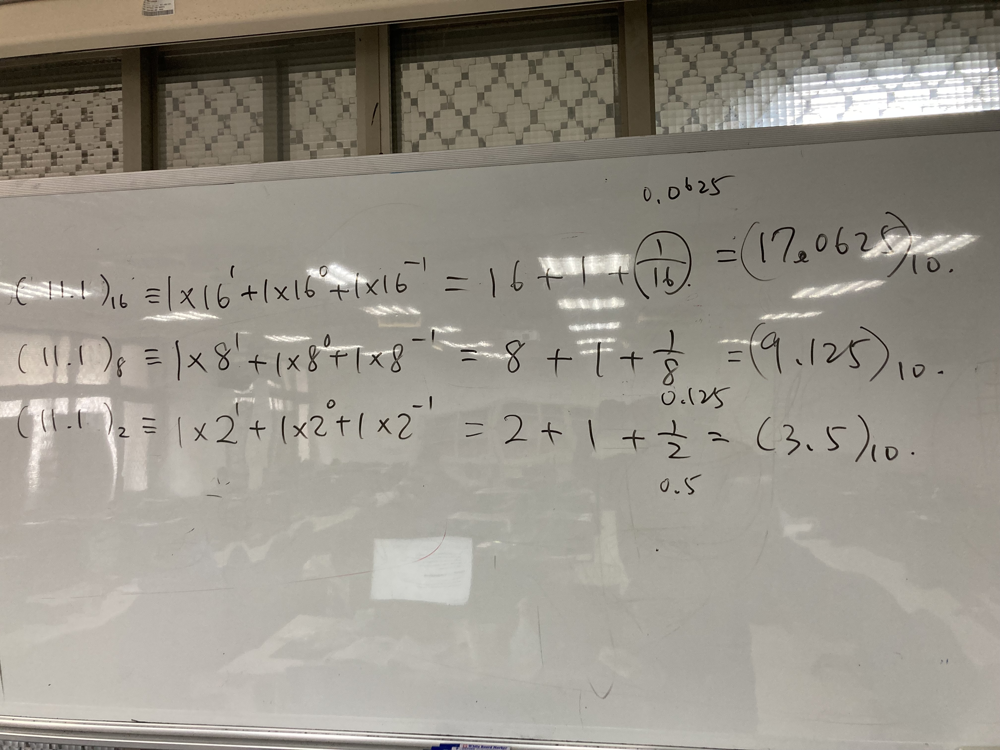
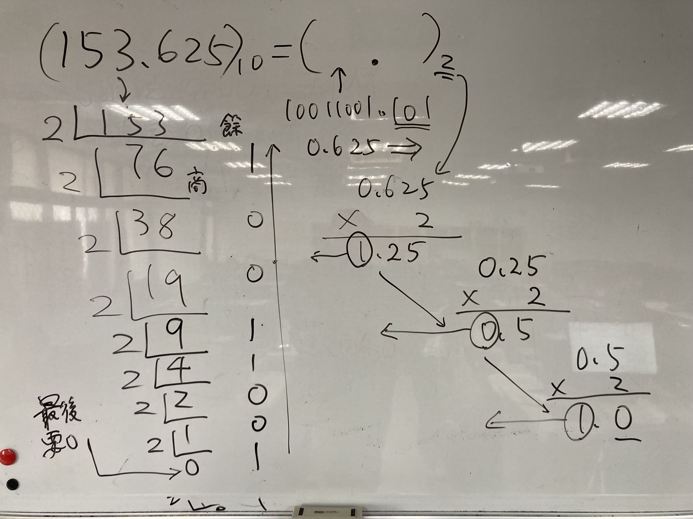
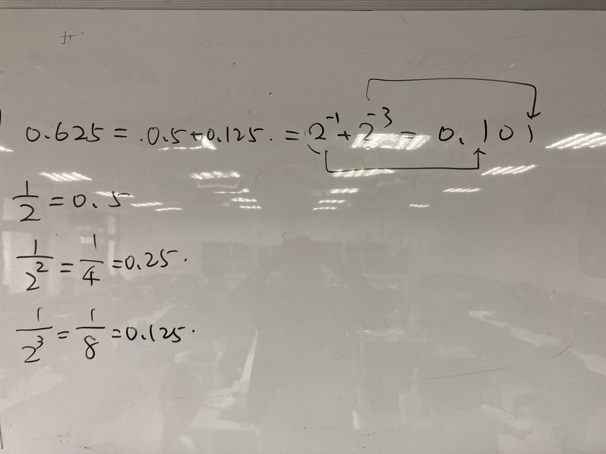
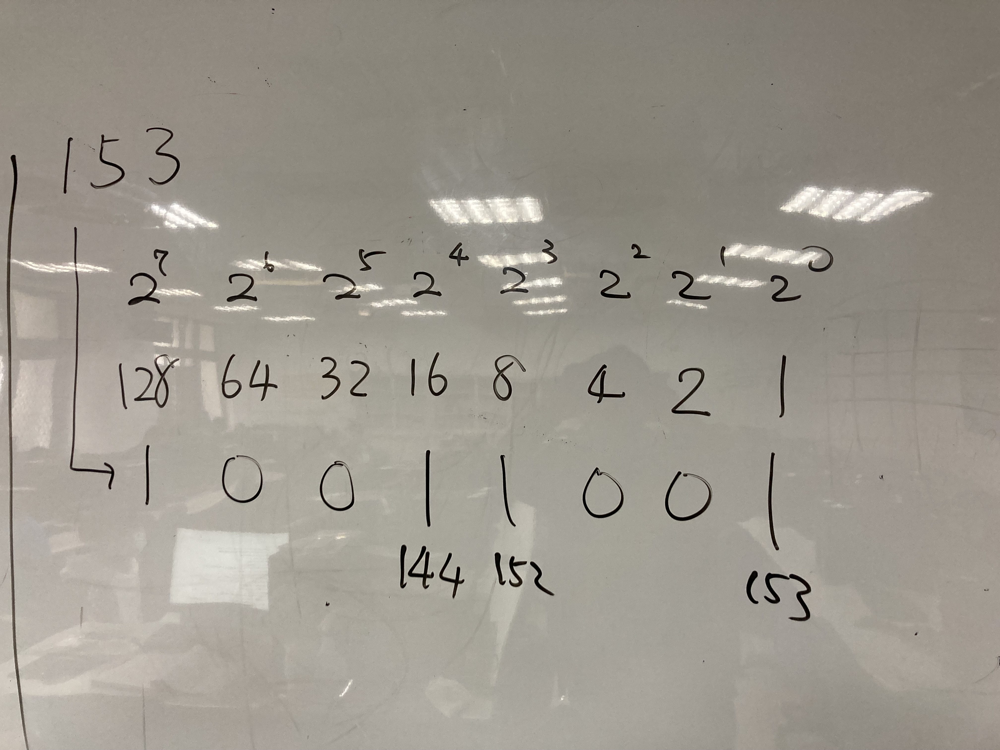
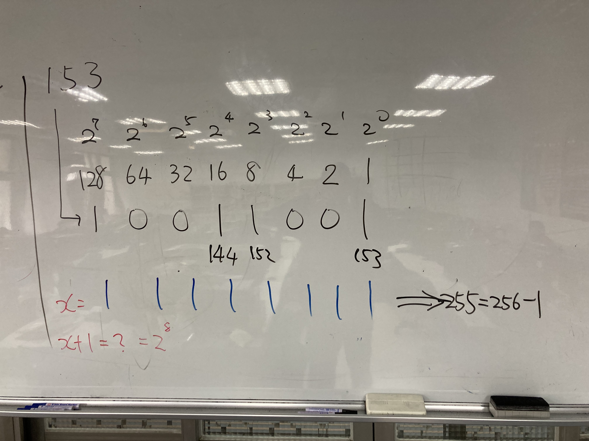
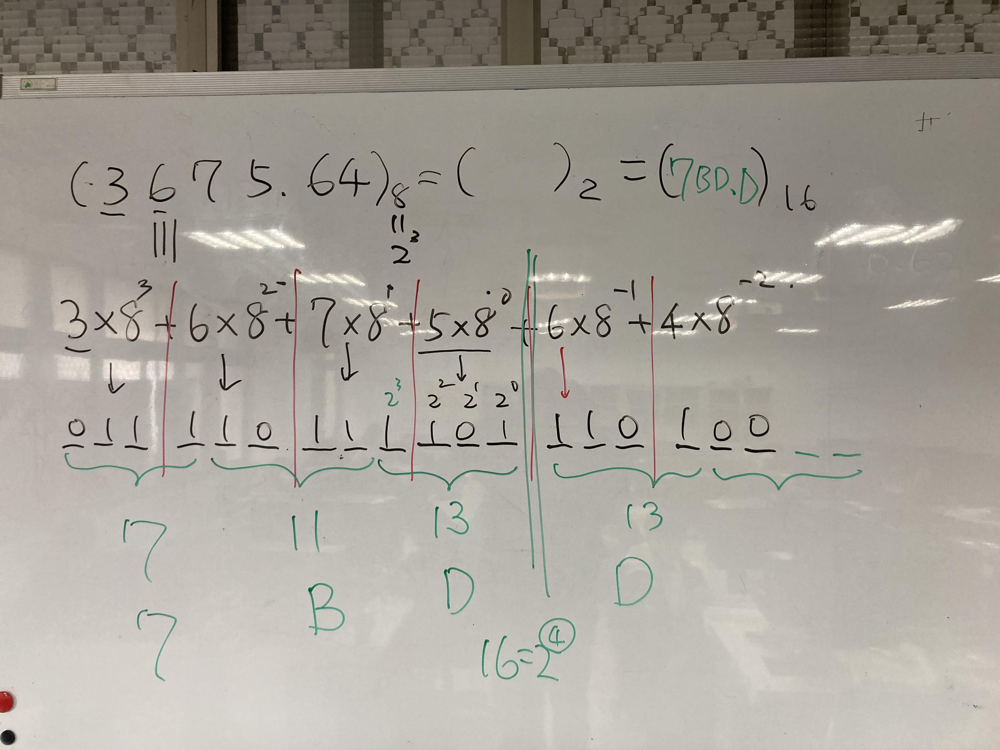

# 文字與數字在電腦的表達法
- 文字在電腦的表達法
  -  [ASCII](https://zh.wikipedia.org/wiki/ASCII)編碼 ==> 使用8 bits 
  -  [Unicode](https://zh.wikipedia.org/wiki/Unicode) 編碼 ==> 使用16 bits 
- 數字在電腦的表達法
  - 整數與小數在電腦的表達法
    - 十六進位（hexadecimal）數字系統
    - 八進位(Octal)數字系統
    - 二進位(binary)數字系統
    - 十進位(decimal)數字系統(The decimal numeral system)
  - 負數在電腦的表達法 ==> 8 - 3 = 8 + (-3)
    - 帶符號大小（signed-magnitude）表示法
    - 1’s 補數（1’s complement）表示法
    - 2’s 補數（2’s complement）表示法 ==> 今日電腦上實際使用的表示法
    - 範例: -38
  - 浮點數(float)在電腦的表達法 ==> IEEE 浮點數（floating-point）表示法
    - 單精準度（single precision） vs 倍精準度(double precision)
    - 正規化（normalization）
    - 浮點數表示法 ==> 1.符號(sign) 2.指數(exponent) 3.尾數(mantissa)

## 數字在電腦的表達法

